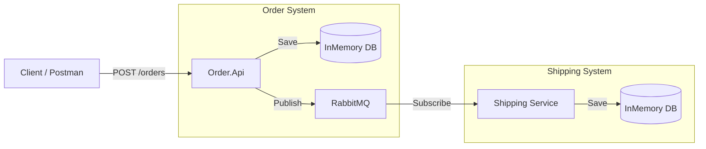

# Opgave: Systemintegration med Web API, RabbitMQ og Entity Framework

Denne opgave går ud på at implementere et distribueret system til ordrehåndtering. Systemet består af to hovedkomponenter: et Web API til modtagelse af ordrer og en modtager-service, der simulerer forsendelse (Shipping).

## Arkitekturoversigt

1.  **Order.Api**: Et ASP.NET Core Web API, der modtager ordrer via HTTP POST.
2.  **RabbitMQ**: En message broker, der formidler beskeder mellem de to services.
3.  **Shipping**: En Worker Service (Hosted Service), der lytter på ordrer og behandler dem.

---

## Opgavebeskrivelse

### 1. Implementering af Order.Api
I projektet `Order.Api` skal I implementere følgende:

*   **Model**: Opret en `Order` klasse med relevante felter (f.eks. `Id`, `CustomerName`, `OrderDate`, `TotalAmount`).
*   **Database**: Konfigurer Entity Framework Core med en **InMemory database** til at gemme ordrerne.
*   **Controller**: Opret en controller (eller brug Minimal APIs) med et endpoint (`POST /orders`), der:
    1.  Modtager en ordre.
    2.  Gemmer ordren i InMemory databasen via EF Core.
    3.  Sender ordren som en besked til RabbitMQ køen "orders".

### 2. Implementering af Shipping Service
I projektet `Shipping` skal I implementere følgende:

*   **Worker**: Opdater den eksisterende `Worker.cs` (eller opret en ny Hosted Service), så den:
    1.  Forbinder til RabbitMQ.
    2.  Lytter på beskeder fra køen "orders".
*   **Database**: Konfigurer ligeledes EF Core med en **InMemory database** i Shipping-projektet.
*   **Logik**: Når en besked modtages, skal ordren gemmes i Shipping-applikationens egen database, og der skal logges en bekræftelse i konsollen.

---

## Tekniske Detaljer & Krav

### Entity Framework Core
I skal tilføje de nødvendige NuGet-pakker til begge projekter:
*   `Microsoft.EntityFrameworkCore.InMemory`

### Beskedkø (RabbitMQ)
Projekterne er allerede sat op med .NET Aspire integration. I skal bruge `IConnection` eller `IChannel` fra `RabbitMQ.Client` til at sende og modtage beskeder.
*   Husk at serialisere jeres ordrer til JSON, før de sendes, og deserialisere dem hos modtageren.

### Kørsel af systemet
Da løsningen bruger .NET Aspire, kan I starte hele systemet ved at køre **AppHost** projektet. Dette vil automatisk starte RabbitMQ (via Docker) og forbinde jeres services.

---

## Succeskriterier
*   Man kan sende en ordre til `Order.Api` via Swagger/Scalar eller et værktøj som Postman/curl.
*   Ordren findes i `Order.Api`'s database efter afsendelse.
*   `Shipping` servicen modtager automatisk ordren og gemmer den i sin egen database.
*   Der er logning i begge services, så man kan følge ordrens flow gennem systemet.
